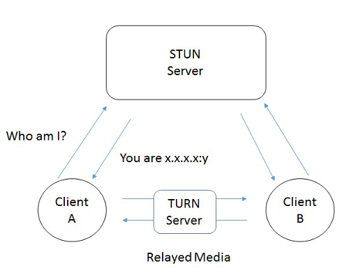

## General Terms that should help you understand WebRTC and the technologies around it.

+ [Signaling](#Signaling)
+ MediaStream
+ back-channel information
+ [datachannel](https://developer.mozilla.org/en-US/docs/Web/Events/datachannel)
+ SDP descriptor
+ internet connectivity establishment (ICE) server
+ [STUN server](#STUN)
+ [TURN server](#TURN)
+ [Stream Control Transmission Protocol](https://developer.mozilla.org/en-US/docs/Glossary/SCTP)
+ [Datagram Transport Layer Security](https://developer.mozilla.org/en-US/docs/Glossary/DTLS)
+ PTSNs
+ dual-tone multi-frequency (DTMF)

## Signaling

WebRTC communicate data streaming between browsers user [RTCPeerConnection](https://developer.mozilla.org/en-US/docs/Web/API/RTCPeerConnection). It uses a mechanism called _Signaling_ to coordinate communication and to send control messages. There are many [signaling methods and protocols](https://github.com/muaz-khan/WebRTC-Experiment/blob/master/Signaling.md) out there.

### STUN

*STUN* stands for Session Traversal Utilities for NAT (Network Address Transalator). According to Wikipedia
> STUN is a standerdized set of methods, including a network protocol, for traversal pf network address translator gateways in applications of real time voice, video, messaging and other interactive communications.

WebRTC is designed to work peer-to-peer, so users can connect directly but because some users may be behind _firewalls_or _NAT gateways_ connections may be blocked thereby causing a connection failure, WebRTC uses STUN and [TURN](/#TURN) servers to mitigate this problem. It basically uses STUN to get the users IP addresses and then uses TURN to relay the transported media between the two clients thereby establishing a reliable connection between the two partys.

### TURN
*TURN* stands for Traversal Using Relays around NAT:
According to Wikipedia:
>(TURN) is a protocol that assists in traversal of network address translators (NAT) or firewalls for multimedia applications. It may be used with the Transmission Control Protocol (TCP) and User Datagram Protocol (UDP). It is most useful for clients on networks masqueraded by symmetric NAT devices.

WebRTC basically uses TURN when STUN only connection fails, it uses [ICE](https://en.wikipedia.org/wiki/Interactive_Connectivity_Establishment) Server to determine the best path to connect peers.

### ICE
*ICE* stands for Intenet Connectivity Establishment. It is a technique that allows computer networks to find the best ways tot talk to each other as directly as possible. WebRTC uses ICE to decide when to use TURN if STUN fails due to Symmetric NATs, Firewalls or other network barriers.

### Security

Encryption is mandatory for all WebRTC components and it's Javascript APIs can only be used over HTTPS or localhost.

[Read more](https://developer.mozilla.org/en-US/docs/Web/Security)